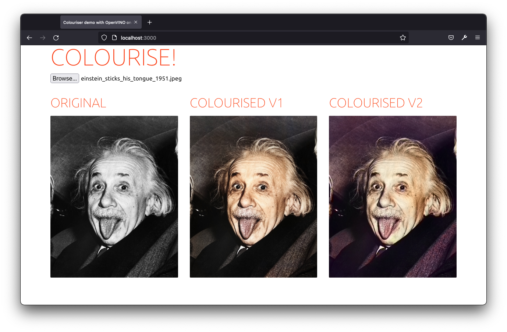
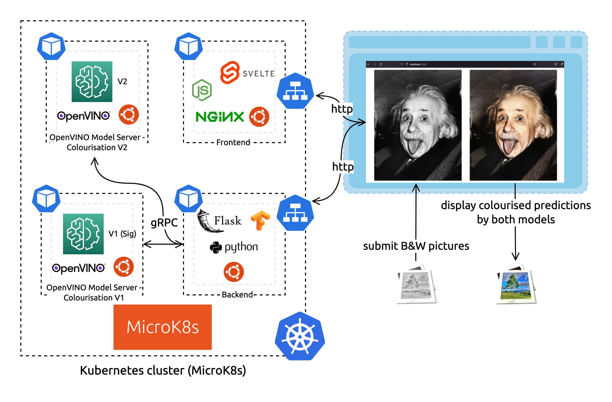

# Colourising black and white images with OpenVINO on Ubuntu demo
... [deployed](#Kubernetes-deployment) on MicroK8s!



The READMEs in this repository are aimed to be technical and help you get started quickly.    
For more stories and explanations, read the Ubuntu blog:
1. [Intel and Canonical to secure containers software supply chain](https://ubuntu.com/blog/secure-containers-supply-chain-intel-openvino-canonical) (Intro)
<!-- 2. []() (Architecture) TODO: blog #1 -->
<!-- 3. []() (How to) TODO: blog #2 -->

## Components 

Our architecture consists of three microservices: a backend, a frontend, and the OpenVINO Model Server to serve the neural network predictions. The Model Server component is deployed two times, as we will compare the results from two different neural networks (V1 and V2). All these components use the Ubuntu base image for a consistent software ecosystem and containerised environment.



### Backend

Interface frontend <> OMS
<!-- TODO -->

### Model Server

Serves the Colorization Model

You can try it alone running
```sh
# Build the image
docker build modelserver --target colorization-v2 -t colorizationv2:latest
# Deploy locally with Docker
docker run --rm -it -p 8001:8001 -p 9001:9001 colorizationv2:latest --model_path /opt/ml/ColorizationV2 --model_name colorization --port 9001 --rest_port 8001
# The REST API is available at http://localhost:8001/
# read more on https://docs.openvino.ai/
```
<!-- TODO -->

### Front end

A sweet interface to try the demo colourisation neural networks!
<!-- TODO -->

## Kubernetes deployment

### Install MicroK8s (if you need a Kubernetes cluster in <5mn)

> You can skip this step if you already have a Kubernetes cluster at hand.

Setup [MicroK8s](https://microk8s.io/) to quickly get a Kubernetes cluster on your machine.

```sh
# https://microk8s.io/docs
sudo snap install microk8s --classic
# Add current user ($USER) to the microk8s group
sudo usermod -a -G microk8s $USER && sudo chown -f -R $USER ~/.kube && newgrp microk8s 
# Enable the DNS, Storage, and Registry addons required later
microk8s enable dns storage registry
# Wait for the cluster to be in a Ready state
microk8s status --wait-ready
# Create an alias to enable the `kubectl` command
sudo snap alias microk8s.kubectl kubectl
```

### Build the components' OCI images

Every [component](#Components) comes with a `Dockerfile` to build itself in a  standard environment and ship with its deployment dependencies (read [What are containers](https://ubuntu.com/containers/what-are-containers)). All components build an Ubuntu-based docker image for a consistent developer experience.

Before being able to deploy all our microservices with Kubernetes to run our colouriser app, we need to build the images and upload them to a registry accessible from our Kubernetes cluster.

#### Backend

```sh
docker build backend -t localhost:32000/backend:latest
docker push localhost:32000/backend:latest
```

#### Model Server for both neural nets

```sh
# model V1 (SigGraph)
docker build modelserver --target colorization-siggraph -t localhost:32000/modelv1:latest
docker push localhost:32000/modelv1:latest
# model V2
docker build modelserver --target colorization-v2 -t localhost:32000/modelv2:latest
docker push localhost:32000/modelv2:latest
```

#### Frontend

```sh
docker build frontend -t localhost:32000/frontend:latest
docker push localhost:32000/frontend:latest
```

### Deploy with Kubernetes

```sh
kubectl apply -f k8s
```

That's it! Access the application at http://localhost:30000/.


## Deploy with Docker Compose

To get started quickly, we also provided a `docker-compose.yaml` file.

```sh
# start the project
docker-compose up
# stop the project
docker-compose up
# clean up
docker-compose up --remove
```

If you make changes in the code, you'll need to specifically rebuild the updated components:

```sh
# rebuild components and deploy the changes
docker-compose up --build
# rebuild a specific component (needs deploy)
docker-compose build <component-name>
```

Access the frontend at http://localhost:8000/ and the backend at http://localhost:8080/.
